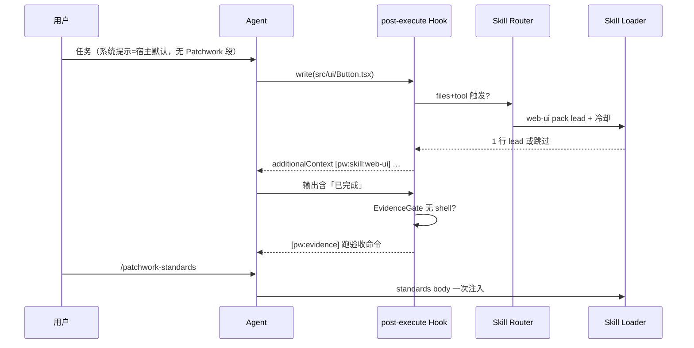

# Patchwork 架构设计 v2 — 合作者插件（精准释放）

> 状态：**设计定稿 → 再实现**  
> 包名：`@patchwork/coding-agent`（不变）  
> 许可证：MIT · 非商用友好、开源  
> 硬约束：**不向 systemPrompt 注入任何插件提示词**

---

## 1. 产品定位

Patchwork 是 DeepSeek Harness 上的 **工程合作者**，不是顺从的代码生成器。

| 维度 | 目标 |
|---|---|
| 代码质量 | 可维护结构、命名、验证路径 |
| Token | 系统提示零注入；技能按需释放；结构警告短码 |
| 姿态 | 反迎合、敢异议、会决策、有规范 |
| 内置能力 | 反 AI 垃圾 · Web/UI 设计 · 架构设计 · 协作决策 · 自有规范 |

---

## 2. 设计原则

1. **零 systemPrompt** — 不用 `systemPrompt.section`；技能只经命令 / Hook 附加上下文 / 工具结果侧路释放。  
2. **融合 → 拆分 → 精准释放** — 外部仓只取规则要点，拆成独立 skill pack，按触发条件加载。  
3. **确定性优先** — 能规则判断的不进模型；进模型的尽量一行短码。  
4. **合作者而非应声虫** — 完成必须有证据；用户说法与代码事实冲突时指出分歧并给选项。  
5. **一包一事** — 每个 skill 只覆盖一种工作姿态，避免大杂烩提示词。

---

## 3. 概览图

```
                    ┌─────────────────────────────────────┐
                    │  DSH Profile · cordis.patch.yml     │
                    │  @patchwork/coding-agent            │
                    └─────────────────┬───────────────────┘
                                      │ apply()
          ┌───────────────────────────┼───────────────────────────┐
          │                           │                           │
          ▼                           ▼                           ▼
   ┌─────────────┐            ┌──────────────┐            ┌──────────────┐
   │ Commands    │            │ Hooks        │            │ Mechanisms   │
   │ /patchwork-*│            │ post-execute │            │ SoL-Pi 四件套│
   └──────┬──────┘            └──────┬───────┘            │ + economy    │
          │                          │                    └──────────────┘
          │    ┌─────────────────────┴─────────────────────┐
          │    │           Skill Router（精准释放）         │
          │    │  trigger → packId → short snippet         │
          │    └─────────────────────┬─────────────────────┘
          │                          │
          ▼                          ▼
   ┌─────────────────────────────────────────────────────┐
   │  assets/skills/   （拆分后的 skill packs）           │
   │  anti-slop · web-ui · architecture ·                │
   │  collaborator · standards · evidence                │
   └─────────────────────────────────────────────────────┘

   systemPrompt: 【空 — 不注册任何 section】
```

---

## 4. 模块地图（职责树）

```
src/
  index.mjs                 # 装配；去掉 systemPrompt.section
  config/plugin-config.mjs  # skill 开关与释放策略
  skills/                   # [NEW] 技能领域
    registry.mjs            # pack 元数据：id、路径、触发器
    router.mjs              # 触发 → 该不该释放、释放哪段
    loader.mjs              # 读 markdown、截取 lead、冷却
    command.mjs             # /patchwork-skill · /patchwork-standards
  quality/                  # [NEW] 合作者行为
    evidence-gate.mjs       # 完成声明 vs shell 证据
    stance.mjs              # 反迎合 stance 短指令
  economy/                  # [NEW] 省 token
    reread-guard.mjs
    token-ledger.mjs
  structure/                # 既有结构检查（警告改短码）
  hook/post-execute-hook.mjs
  review/                   # 既有 /patchwork-review
  mechanisms/               # 既有 SoL-Pi
  ui/                       # 既有面板

assets/
  skills/                   # [NEW] 拆分后的 pack 正文
    anti-slop/SKILL.md
    web-ui/SKILL.md
    architecture/SKILL.md
    collaborator/SKILL.md
    standards/SKILL.md
    evidence/SKILL.md
  prompts/                  # 仅命令用完整长文；**不进 systemPrompt**
```

---

## 5. Skill Packs（融合 · 拆分 · 精准释放）

### 5.1 融合来源（本地收集夹要点，非整仓拷贝）

| Pack | 主要来源（摘规则，不整文件粘贴） | 要点 |
|---|---|---|
| `anti-slop` | hallmark · taste-skill · unslop-ui-skill · De-AI-… | 拒 generic 布局/套话/谄媚文风 |
| `web-ui` | hallmark · frontend-architecture-skill · web design skill | 视觉层次、对比、组件边界、非模板 UI |
| `architecture` | adr-skill · DDD skills · 天枢职责分层 · Patchwork 结构提示 | 职责树、边界、ADR 何时写 |
| `collaborator` | 天枢 CVM/审查纪律 · frank · agents-md · engineering-agent-guide | 反迎合、证据、决策选项 |
| `standards` | 本项目 engineering-agent-guide · git-commit · naming | **自有规范**唯一权威 |
| `evidence` | 天枢 DeliveryGate · 审查纪律 fail-closed | 无命令输出不得称完成 |

**许可**：收集夹多为 MIT/Apache；CC BY-NC-ND（天枢文档）只**转述规则**不抄长文。本插件 MIT。

### 5.2 拆分形态

每个 pack：

```markdown
---
id: web-ui
title: Web/UI 设计
triggers: [file:.css,.scss,.html,.jsx,.tsx, path:src/ui/, path:components/]
lead: 20 行以内可注入摘要
body: 完整规则（仅 /patchwork-skill web-ui 全量拉入）
---
```

- **lead**：Hook / 自动释放用（短）  
- **body**：命令按需全量（长）

### 5.3 精准释放（无 systemPrompt）

| 通道 | 何时 | 释放什么 | 占窗口 |
|---|---|---|---|
| **命令** | 用户 `/patchwork-skill <id>` 或 `/patchwork-standards` | 对应 pack 的 **body** | 用户主动，一次 |
| **命令** | `/patchwork-review [范围]` | 既有 user-review 提示 | 已有 |
| **Hook 自动** | `write`/`edit` 命中 trigger | pack **lead**（冷却去重） | 极低 |
| **Hook 证据** | 完成断言且无 shell 证据 | `[pw:evidence]` 一行 | 极低 |
| **Hook 结构** | 大文件/坏命名 | `[pw:structure]` 短码 | 极低 |
| **standoff stance** | 冲突/改口场景（后续） | collaborator lead | 按需 |

**禁止**：任何 `ctx.systemPrompt.section(...)`。

### 5.4 触发器设计

```js
// registry.mjs 概念
triggers: {
  fileExts: ['.css', '.html', '.jsx', '.tsx', '.vue'],
  pathIncludes: ['/ui/', '/components/', '/styles/'],
  toolNames: ['write', 'edit'],
}
// router.shouldRelease(session, { files, tool }) → packId | null
// 同一 session 同 pack：冷却 N 轮（复用 warning-cooldown）
```

多 pack 同时命中 → **优先级**：`standards` < `anti-slop` < `web-ui` / `architecture` < `evidence`；**一次只注入一个 lead**（防刷屏）。

---

## 6. 合作者姿态（反迎合 · 决策）

### 6.1 行为契约（进 collaborator pack body + evidence hook）

1. **不空口同意**：用户说法与代码/测试冲突时，先给 **可验证事实**，再给选项 A/B。  
2. **会决策**：默认给出推荐 + 一句取舍，不问「你想怎样」空转。  
3. **不表演道歉**：纠错只陈述改了什么、如何验证。  
4. **完成 = 证据**：EvidenceGate 强制。  
5. **规范唯一**：`assets` + `docs/*` 是规范源；不引入第二套互相打架的标准。

### 6.2 EvidenceGate

- 记录 session 内最近成功 shell（`pwsh`/`bash`/`run_tests`）。  
- 检测完成类断言（中英 pattern 可配）。  
- 无证据 → additionalContext：`[pw:evidence] …`  
- 默认开；不阻断工具。

---

## 7. 配置（Schemastery）

```js
export const Config = Schema.object({
  // SoL-Pi（既有）
  actionFusion: Schema.boolean().default(true),
  observationPack: Schema.boolean().default(true),   // v2 建议默认开
  evidencePreservingReducer: Schema.boolean().default(false),
  onlineContextCompact: Schema.boolean().default(false),
  reducerProvider: Schema.string(),
  reducerModel: Schema.string(),
  cacheWriteReadRatio: Schema.number().default(12.5),

  // 技能释放 v2
  skillAutoRelease: Schema.boolean().default(true),  // Hook 精准释放 lead
  evidenceGate: Schema.boolean().default(true),
  skillCooldownRounds: Schema.number().default(30),
  // 总闸：关则全部新技能行为静默
  tokenEfficiency: Schema.boolean().default(true),
})
```

**无** `injectSystemPrompt` 类开关——系统提示注入被架构移除，不是可选项。

---

## 8. 命令面

| 命令 | 作用 |
|---|---|
| `/patchwork-skill [id]` | 列出 pack 或注入某 pack body |
| `/patchwork-standards` | 注入自有规范全文（standards pack） |
| `/patchwork-review [scope]` | 既有用户视角评审 |
| `/patchwork-skills` | 同 skill 列表别名（可选） |

---

## 9. 与 SoL-Pi / 经济性关系

| 层 | 内容 |
|---|---|
| 省 token（会话固定开销） | **去掉 systemPrompt 注入**（最大头） |
| 省 token（动态） | skill lead 短码 + 冷却 + 结构短码 + reread/obs 分页 |
| 语义质量 | skills + evidence + 既有 review |
| 既有四机制 | 保留；actionFusion 默认开 |

---

## 10. 信息流（释放时序）



---

## 11. 实施顺序（设计定稿后）

| Phase | 内容 | 验收 |
|---|---|---|
| **0** | 去掉 `systemPrompt.section`；`inject` 去掉 `systemPrompt` | 启动无 Patchwork 提示词；测试改断言 |
| **1** | `assets/skills/*` 六 pack + `registry/loader/router` | 单测：lead 长度、冷却、优先级 |
| **2** | `/patchwork-skill` `/patchwork-standards` | 命令注入 body |
| **3** | Hook 接入 router + EvidenceGate + 结构短码 | 真实 post-execute 路径 |
| **4** | 配置默认值 + 面板计数 + README/设计同步 | `node --test` 全绿 |
| **5** | 浏览器预览 `index.html`（架构产品页） | cwd 可打开 |

**先设计后写**：本文件 + `index.html` 架构页 = 设计交付；**未改插件运行时代码**直至你确认 Phase 0 开工。

---

## 12. 开源与边界

- 许可证：**MIT**（与现包一致）  
- 非商用：用户声明不商用；我们不添加 NC 限制，保持可开源协作  
- 不引入 Copyleft 依赖正文；融合内容以**改写规则要点**为主，避免 CC BY-NC-ND 长文粘贴  

---

## 13. 成功定义

1. 插件加载后 **systemPrompt 中无 patchwork 段**。  
2. 用户可用命令拉齐规范与五大技能包。  
3. 编辑 UI/架构相关文件时，**仅**多出一条带冷却的 skill lead。  
4. 无证据的「完成」会被 `[pw:evidence]` 拦一次。  
5. 六 pack 可独立改文案，互不耦合。  
6. `index.html` 可预览本架构。  
7. 测试全绿；未要求不 push。
