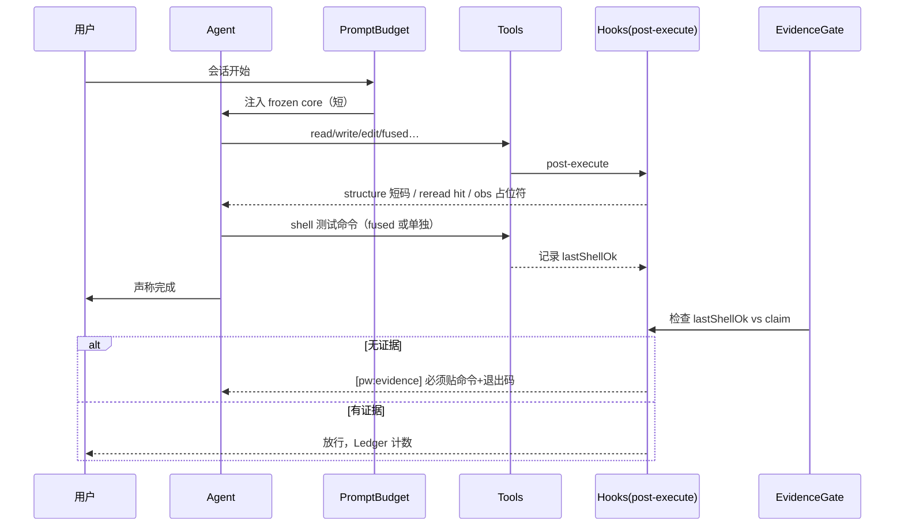

# 设计方案：Patchwork v2 — 少 Token 的可维护编码插件

> 状态：**方案草案（未实现）**  
> 基座：当前 `@patchwork/coding-agent` 0.1.2 · DSH 0.1.7-alpha.2  
> 目标：在**不牺牲正确性与可维护性**的前提下，显著降低长会话 token 消耗  
> 参考（本地收集夹）：SoL-Pi 四机制、天枢 CVM/审查纪律、superpowers、工程标准 skill

---

## 1. 问题与目标

### 1.1 现状痛点

| 问题 | 现状 |
|---|---|
| 提示词偏长 | `maintainable-coding-agent-prompt.md` 全文每次会话注入，约 80+ 行 |
| 结构 Hook 偏重复 | `additionalContexts` 每次告警都塞一段提示词进上下文（有 30 轮冷却，但仍占窗口） |
| 观察结果占窗口 | 工具完整输出、重复读文件、无分页的 observation 进模型 |
| 缺少「完成」硬门禁 | 提示词要求证据，但无运行时 gate；易产生「说了完成其实没跑」的往返浪费 |
| 复用不足 | 每步重读相同文件、重复 grep、重复跑已知通过的命令 |

### 1.2 目标（可度量）

| 指标 | 目标（相对当前同任务基线） |
|---|---|
| 输入 token / 任务 | **−40% ~ −60%**（前缀缓存命中后账单再降） |
| 往返轮次 / 任务 | **−20%**（少试错、少空转） |
| 「假完成」导致的补跑 | 接近 **0**（无证据不得标完成） |
| 可维护性 | 单文件职责、命名、验证路径 **不低于现状**（结构 Hook 保留） |

### 1.3 非目标

- 不重写 DSH、不替换宿主工具体系  
- 不做完整多 agent 编排产品（`/team` `/council` 不进 v2 核心）  
- 不默认打开需外部模型的在线压缩（可选、可关）  
- 不承诺「零 token 成本」——省的是**重复与无效** token，不是必要推理

---

## 2. 设计原则

1. **确定性优先于 LLM**：能靠规则/哈希/门禁解决的，不调模型、不进上下文。  
2. **模型只看增量与决策面**：全文仅在必要时出现；其余用占位符、摘要、页眉。  
3. **完成 = 运行时证据**：无命令+输出，additionalContext 拦截，拒绝「已完成」叙事。  
4. **提示词单一来源、字节稳定**：利于前缀缓存（DSH 若有类似缓存则直接受益）。  
5. **配置默认安全**：省 token 机制默认可开且不改语义；改语义的默认关。  
6. **一逻辑一变更**：Conventional Commits；推送需用户明确要求。

---

## 3. 总体架构

在现有 Cordis 插件形态上扩展，**不另起炉灶**：

```
┌─────────────────────────────────────────────────────────────┐
│  DSH Profile · cordis.patch.yml · patchwork-agent           │
├─────────────────────────────────────────────────────────────┤
│  src/index.mjs  apply()                                    │
│    ├─ systemPrompt.section   （精简 + 分段稳定锚）          │
│    ├─ registerReviewCommand  （保留）                      │
│    ├─ registerStructureHook  （升级为「低成本规则注入」）   │
│    ├─ registerConfiguredMechanisms                         │
│    │     ├─ actionFusion        默认开                     │
│    │     ├─ observationPack     默认开（v2 提升）           │
│    │     ├─ evidencePreservingReducer  默认关               │
│    │     ├─ onlineContextCompact      默认关               │
│    │     ├─ [NEW] evidenceGate        默认开               │
│    │     ├─ [NEW] staleRereadGuard    默认开               │
│    │     └─ [NEW] promptBudget        默认开               │
│    ├─ configRoute + statsInjection（面板）                 │
│    └─ tokenLedger（累计计数，进面板）                      │
└─────────────────────────────────────────────────────────────┘
```

**表面入口不变**：`src/index.mjs` → 配置 → 机制注册 → Hook/命令。

---

## 4. 模块设计

### 4.1 PromptBudget — 提示词与注入预算（省 token 主抓手）

**问题**：系统提示词 + 每次 warning 的 additionalContext 是固定/半固定开销。

**方案**：

| 技术 | 行为 |
|---|---|
| **核心壳（frozen shell）** | `assets/prompts/maintainable-coding-agent-prompt.md` 拆为：`core.md`（短，≤40 行，会话必载）+ `detail.md`（结构/命名细则，仅首读或 `/patchwork-rules` 按需注入） |
| **字节稳定 core** | core 不随会话变化，利于宿主前缀缓存 |
| **Hook 注入格式化** | 结构警告改为**单行短格式**：`[pw:structure] path:820 lines split?` + 链接到本地规则文件路径，而非整段散文 |
| **冷却升级** | 现有 30 轮冷却保留；同 code+file 哈希去重（`warning-cooldown.mjs` 扩展 `contentKey`） |
| **`/patchwork-rules`** | 命令按需拉入 detail + 上次告警摘要（用户主动要才进大文本） |

**默认**：`promptBudget: true`  
**验收**：同任务前后对比 `tokenLedger.inputTokens`；core 行数上限有测试。

---

### 4.2 EvidenceGate — 完成必须带证据（好代码 + 少返工）

借鉴天枢 DeliveryGate / 审查纪律 fail-closed，落在 DSH 可实现的边界。

**触发**（`tools/post-execute` 之后或 `deliver` 类语义，v2 先做启发式）：

1. 模型 output / followup 文本匹配「完成类断言」：`已完成|修好了|全部通过|done|fixed|passing`  
2. 同 session 自上次 **真实命令执行**（`pwsh`/`bash`/`run_tests`）之后，**无**成功命令记录  
3. 则注入**极短** additionalContext：

```
[pw:evidence] 完成断言缺少命令证据。请跑一次能复现验收的命令并贴出退出码；否则改为「未验证」。
```

**状态**：进程内 `Map<sessionId, {lastShellOkAt, lastClaimAt}>`，随 agent 销毁清理。  
**默认**：`evidenceGate: true`  
**不阻断**工具（与现有 Hook 一致，advisory），但计数进面板 `evidenceBlocks`。  
**反迎合**：禁止模型用道歉/改口替代跑命令——注入句是祈使句，不要求自我批评（避免更多 token）。

---

### 4.3 StaleRereadGuard — 防重复读（省观察 token）

**问题**：反复 read/grep 同一未变文件。

**方案**：

- `tools/post-execute`：记录 `(sessionId, absPath, size+mtime+hash)`  
- 再次 **read** 同一 path 且内容哈希未变 → 不禁止，但注入 1 行：  
  `[pw:reread] unchanged cache hit — use prior excerpt; call read only if you need another range`  
- 可选进阶（v2.1）：**包装 read 工具**，未变时返回 **页眉占位 + 明确可用 offset**，正文仅首次全量（与 ObservationPack 生命周期对齐）  
- **默认**：guard 日志开；工具包装与 observationPack 共用开关（`staleRereadGuard` 默认 true，包装部分跟随 `observationPack`）

**验收**：同一 session 重复 read 未变文件 → `stats.rereadHits` 递增；模型可见正文次数 = 1（包装开启时）。

---

### 4.4 ObservationPack（现有）— v2 强化点

已有：首次入库后换占位符（宿主 `tools/post-execute` accept）。

**v2 增强**：

| 项 | 说明 |
|---|---|
| 页眉策略 | 固定格式：`[obs:tool path L1-120 · 4.2KB · hash=ab12… · full#n]` |
| 分页默认 | 单次 accept 上限 **2–4KB** 或 **120 行**（可配），超出走 artifact/locator 语义（沿用现有 content-archive） |
| 与 StaleReread 协同 | 同一 `#n` 内容哈希不变则不再产生新 full 页 |
| 默认 | **`observationPack: true`**（v2 提升默认；省 token 且首轮仍可见全文） |

---

### 4.5 ActionFusion（现有）— 保持默认开

写/编辑可附带跟进命令，减少「写→看输出→再跑」的独立轮次。

**v2 微调**：

- 融合命令仅允许 **白名单**前缀（`node --test`、`npm test`、`tsc`、`git diff --check` 等可配），避免任意 shell 拖长输出  
- 输出超长时同样走 ObservationPack 分页  

---

### 4.6 EvidencePreservingReducer / OnlineContextCompact（现有）

保持 **默认关**。v2 只保证：

- 与 `evidenceGate`、`promptBudget` 同一 Config schema 注册  
- 面板能显示「输入/输出/缓存命中/告警/证据拦截」四类计数  

---

### 4.7 Structure Hook — 保留，但改造成「便宜规则」

| 现状 | v2 |
|---|---|
| 散文式警告 | 短码 + 路径 + 阈值 |
| 每类问题一整段 | `code` 映射到 `assets/prompts/rules/*.md` 单行摘要（已本地化，不重复长文） |
| 只检查大文件/兜底名 | 增加：**未改文档却改行为**（可选，默认关）——避免过严误报 token |

**反迎合/好代码**：警告只要求**动作**（拆分/改名/验证），不要求模型复述原则全文。

---

### 4.8 TokenLedger + 面板

扩展 `src/ui/mechanism-stats.mjs`：

```text
counters:
  structureWarnings
  rereadHits
  evidenceBlocks
  observationPagesServed   // 观察分页次数
  fusedCommands
  inputTokens / outputTokens   // 若宿主可回读 usage；否则记「页面/字节」代理指标
```

面板第三屏：**Token 经济** — 显示相对会话基线的节省估算（分页字节 + reread + fused）。

---

## 5. 配置面（Schemastery）

```js
Config = {
  // 既有
  actionFusion: true,
  observationPack: true,              // v2 默认改为 true
  evidencePreservingReducer: false,
  onlineContextCompact: false,
  reducerProvider, reducerModel,
  cacheWriteReadRatio: 12.5,

  // 新增
  promptBudget: true,                 // 短 core + 短 warning
  evidenceGate: true,                 // 完成需命令证据
  staleRereadGuard: true,             // 重复读提示/协同 pack
  observationMaxBytes: 4096,          // pack 单次正文上限
  observationMaxLines: 120,
  evidenceClaimPattern: null,         // 可选自定义完成断言正则
}
```

**默认策略**：省 token 且不改「语义正确性」的 → 默认开；需外部模型/易误伤 → 默认关。

---

## 6. 目录与命名（职责树）

在现有树上**增量**，不推倒：

```text
src/
  index.mjs                 # 装配（已有）
  config/plugin-config.mjs  # + 新开关
  prompt/
    load-prompt.mjs         # [NEW] core/detail 加载与分段
  hook/
    post-execute-hook.mjs   # 组合：structure + reread + evidence 采集
  quality/                  # [NEW] 领域：好代码相关
    evidence-gate.mjs       # 完成断言 vs shell 证据
    claim-patterns.mjs
  economy/                  # [NEW] 领域：省 token
    reread-guard.mjs
    prompt-budget.mjs
    token-ledger.mjs
  structure/                # 已有，警告格式改 economy 消费的短码
  mechanisms/               # 已有四机制 + 面板计数打通
  review/                   # 已有
  ui/                       # 已有
assets/prompts/
  maintainable-coding-agent-prompt.md  # 改为壳，或拆 core/detail
  rules/structure-warnings.md
  rules/evidence-gate.md
```

**命名**：`quality` / `economy` 表达业务职责，避免 `utils2`、`helpers`。

---

## 7. 会话内信息流（目标形态）



---

## 8. 分阶段实施

### Phase 0 — 基线（0.5d）
- [ ] 固定 2–3 个真实维护任务作 **token/轮次基线**（`benchmark/` 扩展或一次性脚本）
- [ ] 记录：input tokens、轮数、结构告警次数

### Phase 1 — PromptBudget + 结构短码（1–2d）
- [ ] 拆 core/detail；`promptBudget` 开关
- [ ] `buildStructureWarning` 输出短码
- [ ] 冷却 contentKey 去重
- [ ] 测试：core 行数、警告字节数、重复告警不注入

### Phase 2 — EvidenceGate + TokenLedger（1–2d）
- [ ] shell 成功记录 + 完成断言启发式
- [ ] 短 additionalContext
- [ ] 面板计数 `evidenceBlocks`
- [ ] 测试：有证据放行 / 无证据拦截 / 不阻断工具

### Phase 3 — StaleReread + ObservationPack 默认开（1–2d）
- [ ] reread 哈希命中计数与 1 行提示
- [ ] observationPack 默认 true + 分页上限配置
- [ ] 对比 Phase 0 基线的节省

### Phase 4 — 回归与文档（0.5d）
- [ ] `node --test` 全绿
- [ ] README / 配置表 / solpi 设计文档更新
- [ ] 可选：DSH 真实 Loader 冒烟（独立终端，不扰动当前会话）

**合计**：约 **4–6 个有效工作日**（单人、含测试）。

---

## 9. 验证计划（证据）

| 层级 | 做什么 | 通过判据 |
|---|---|---|
| 单元 | prompt 分段、claim 正则、reread hash、warning 短码 | `node --test` |
| 现有 real-composition | 四机制不回归 | 既有套件仍绿 |
| 会话脚本 | 同一任务 A/B（promptBudget on/off） | 输入 token 与字节数下降，任务完成定义不变 |
| 面板 | 计数随机制递增 | UI 注入仍兼容多实例 sharedWriteToken |
| 人工 | 一次真实小 feature | 完成必须贴命令；无「假完成」 |

**汇报纪律**（对齐 engineering-agent-guide）：只报实际跑过的命令与结果；未做的写明未做。

---

## 10. 风险与对策

| 风险 | 对策 |
|---|---|
| EvidenceGate 误伤（中文「通过了」但指静态检查） | pattern 可配；允许 `run_tests`/`tsc`/`node --test` 白名单命令即算证据 |
| 短警告不够可执行 | 短码 + `/patchwork-rules` 一键展开；本地 `rules/*.md` 固定路径 |
| observationPack 默认开改变「首屏全文」预期 | 保持**首次全量**再占位；配置可关 |
| 双实例注册（已有坑） | 沿用 WeakSet / sharedWriteToken 模式；新机制同样进程级共享 |
| 提示词拆分破坏缓存 | core 字节冻结；detail 只进按需命令，不进每轮 volatile |

---

## 11. 成功定义（DoD）

1. Config 三新键可配，默认值如上；缺省启动日志打印启用机制列表。  
2. 同类任务相对 Phase 0：**输入 token 或注入字节明显下降**（目标 ≥40%，以 Ledger/字节代理可复现）。  
3. 完成断言在无 shell 证据时收到一次短 `[pw:evidence]`，有证据不骚扰。  
4. 结构与反命名检查仍在，且单次告警体积显著小于现散文。  
5. `node --test` 全绿；README 与配置表已同步。  
6. 未要求则不 push；一任务一 Conventional Commit。

---

## 12. 与收集仓的对应（便于回查）

| 设计点 | 参考 |
|---|---|
| 观察分页/占位 | SoL-Pi ObservationPack（仓库内已实现） |
| 上下文压缩经济性 | online-context-compact、SoL-Pi |
| 完成证据 / 反迎合 | 天枢 CVM DeliveryGate、审查纪律 fail-closed；`frank`、`agents-md` |
| 短提示词与按需规则 | PromptBudget；superpowers 分层加载思路 |
| 工程规范默认路径 | `engineering-standards-plugin`、`adr-skill`（规范文案可挂 `/patchwork-rules`） |
| 前缀缓存 | 天枢 frozen+appendix（DSH 侧用字节稳定 core 对齐） |

---

## 13. 待你拍板的决策点

1. **命名**：产品名继续 `@patchwork/coding-agent`，还是 fork 新名（如 `patchwork-economy`）？  
2. **observationPack 是否直接默认 true**（推荐：是，与 actionFusion 同级「装上即省」）？  
3. **EvidenceGate 严格度**：仅启发式断言，还是连 `/patchwork-review` 也强制证据？  
4. **Token 计量**：宿主若拿不到 usage，是否接受「注入字节/分页次数」作代理指标？  
5. 是否需要 **独立开关总闸** `tokenEfficiency: true` 一键关全部新机制？

---

**下一步**：确认决策点后，按 Phase 1 开工；先不改代码，直到你点头选型。
